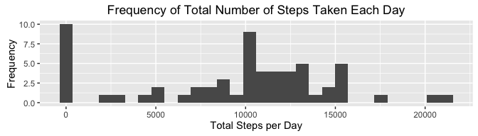
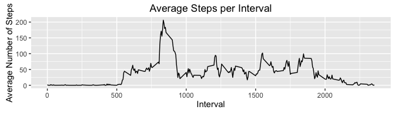
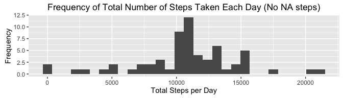
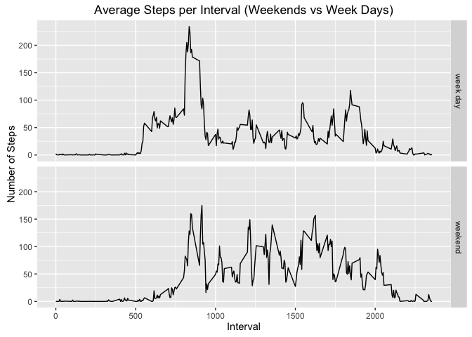

# Reproducible Research: Peer Assessment 1 (By: U. Kemiktarak)

## Loading and preprocessing the data
Show any code that is needed to  
1- Load the data (i.e. 𝚛𝚎𝚊𝚍.𝚌𝚜𝚟())

```r
    activityDF <- read.csv("activity.csv", stringsAsFactors = FALSE )
```
2- Process/transform the data (if necessary) into a format suitable for your analysis activityDF

## What is mean total number of steps taken per day?
For this part of the assignment, you can ignore the missing values in the dataset.  
1- Calculate the total number of steps taken per day

```r
    library(dplyr)
    library(ggplot2)
    # total number of steps per day
    totalStepsPerDay <- activityDF %>%
        group_by(date) %>%
        summarize(totalSteps = sum(steps, na.rm=TRUE))
    head(totalStepsPerDay)
```

```
## # A tibble: 6 × 2
##         date totalSteps
##        <chr>      <int>
## 1 2012-10-01          0
## 2 2012-10-02        126
## 3 2012-10-03      11352
## 4 2012-10-04      12116
## 5 2012-10-05      13294
## 6 2012-10-06      15420
```

2- If you do not understand the difference between a histogram and a barplot, research the difference between them. Make a histogram of the total number of steps taken each day

```r
    qplot(totalStepsPerDay$totalSteps,
          main = "Frequency of Total Number of Steps Taken Each Day",
          xlab = "Total Steps per Day",
          ylab = "Frequency")    
```

<!-- -->

3- Calculate and report the mean and median of the total number of steps taken per day

```r
    meanTotalSteps <- mean(totalStepsPerDay$totalSteps)
    medianTotalSteps <- median(totalStepsPerDay$totalSteps)
```

```r
    meanTotalSteps
```

```
## [1] 9354.23
```

```r
    medianTotalSteps
```

```
## [1] 10395
```
    
## What is the average daily activity pattern?
1- Make a time series plot (i.e. 𝚝𝚢𝚙𝚎 = "𝚕") of the 5-minute interval (x- axis) and the average number of steps taken, averaged across all days (y-axis)

```r
    ## calculate average number of steps per interval
    meanStepsPerInterval <- activityDF %>%
        group_by(interval) %>%
        summarize(meanSteps = mean(steps, na.rm = TRUE))
    
    ## generate plot
    ggplot(data=meanStepsPerInterval, aes(x=interval, y=meanSteps))+
        labs(title="Average Steps per Interval", x="Interval", y="Average Number of Steps") +
        geom_line()
```

<!-- -->

2- Which 5-minute interval, on average across all the days in the dataset, contains the maximum number of steps?

```r
    intervalWithMaxSteps <- meanStepsPerInterval[meanStepsPerInterval$meanSteps==max(meanStepsPerInterval$meanSteps), "interval"] 
    intervalWithMaxSteps$interval
```

```
## [1] 835
```
        
## Imputing missing values
Note that there are a number of days/intervals where there are missing values (coded as 𝙽𝙰). The presence of missing days may introduce bias into some calculations or summaries of the data.  
1- Calculate and report the total number of missing values in the dataset (i.e. the total number of rows with 𝙽𝙰s)

```r
    totalNumOfNA <- nrow(activityDF[is.na(activityDF$steps),])    
    totalNumOfNA
```

```
## [1] 2304
```
2- Devise a strategy for filling in all of the missing values in the dataset. The strategy does not need to be sophisticated. For example, you could use the mean/median for that day, or the mean for that 5-minute interval, etc.    

Strategy to be used: Average number of steps per interval calculated by removing NA values will be used for corresponding interval with the "NA" steps value    

3- Create a new dataset that is equal to the original dataset but with the missing data filled in.

```r
    activityDFNoNA <- activityDF
    # add a new column to store mean steps value for the corresponding interval and set the value to 0
    activityDFNoNA <- mutate(activityDFNoNA, meanSteps=0)
    # update the  the new column with the corresponding interval mean
    activityDFNoNA[,4] <- meanStepsPerInterval[ match(meanStepsPerInterval$interval, activityDFNoNA$interval), 2]
    # update steps column with the 4th column for the records with NA steps
    # remove 4th column
    activityDFNoNA <- activityDFNoNA %>% 
        mutate(steps = ifelse(is.na(steps), meanSteps, steps)) %>%
        select(1:3)
```
    
4- Make a histogram of the total number of steps taken each day and Calculate and report the mean and median total number of steps taken per day. Do these values differ from the estimates from the first part of the assignment? What is the impact of imputing missing data on the estimates of the total daily number of steps?

```r
    ##  total number of steps taken per day
    totalStepsPerDay2 <- activityDFNoNA %>%
        group_by(date) %>%
        summarize(totalSteps = sum(steps, na.rm=TRUE))
    ##  histogram of the total number of steps taken each day
    qplot(totalStepsPerDay2$totalSteps,
          main = "Frequency of Total Number of Steps Taken Each Day (No NA steps)",
          xlab = "Total Steps per Day",
          ylab = "Frequency")    
```

<!-- -->

```r
    ##  the mean and median of the total number of steps taken per day
    meanTotalSteps2 <- mean(totalStepsPerDay2$totalSteps)
    medianTotalSteps2 <- median(totalStepsPerDay2$totalSteps)
```

```r
    meanTotalSteps2
```

```
## [1] 10766.19
```

```r
    medianTotalSteps2
```

```
## [1] 10766.19
```
    
## Are there differences in activity patterns between weekdays and weekends?
For this part the 𝚠𝚎𝚎𝚔𝚍𝚊𝚢𝚜() function may be of some help here. Use the dataset with the filled-in missing values for this part.  
1- Create a new factor variable in the dataset with two levels – “weekday” and “weekend” indicating whether a given date is a weekday or weekend day.

```r
    ## create a vector of weekend days
    weekend <- c("Saturday", "Sunday")
    ## create a new column "day" to define if the date is a weekend or a week day
    activityDF <- activityDF %>%
        mutate(date = as.Date(x=date, format="%Y-%m-%d")) %>%
        mutate(day = ifelse(weekdays(date) %in% weekend, "weekend", "week day"))
```
2- Make a panel plot containing a time series plot (i.e. 𝚝𝚢𝚙𝚎 = "𝚕") of the 5-minute interval (x-axis) and the average number of steps taken, averaged across all weekday days or weekend days (y-axis). See the README file in the GitHub repository to see an example of what this plot should look like using simulated data.

```r
    ## calculate average number of steps per interval
    meanStepsPerIntervalByWeekDays <- activityDF %>%
        group_by(interval, day) %>%
        summarize(meanSteps = mean(steps, na.rm = TRUE))
    ## generate plot
    ggplot(data=meanStepsPerIntervalByWeekDays, aes(x=interval, y=meanSteps)) +
        labs(title = "Average Steps per Interval (Weekends vs Week Days)",
             x = "Interval",
             y = "Number of Steps") +
        facet_grid(facets=day~.) +
        geom_line()
```

<!-- -->
